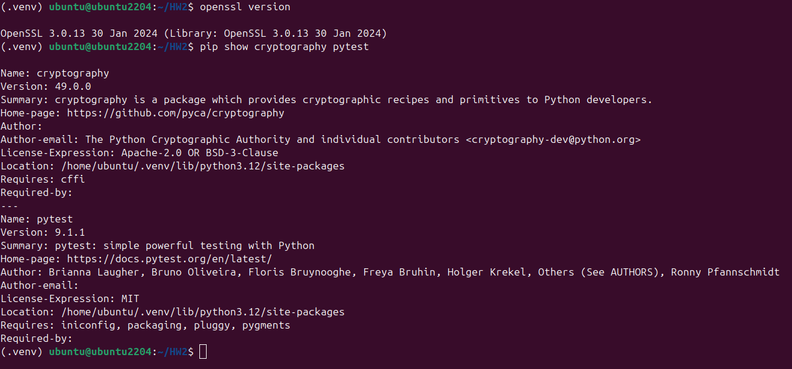
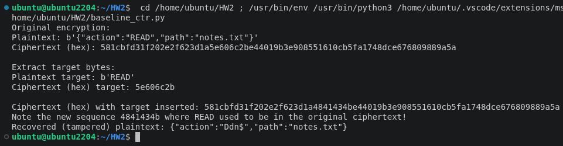
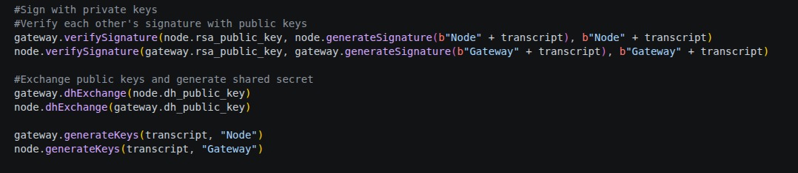
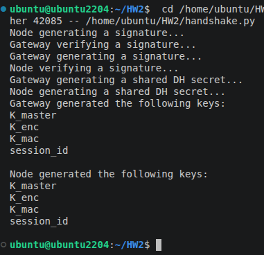
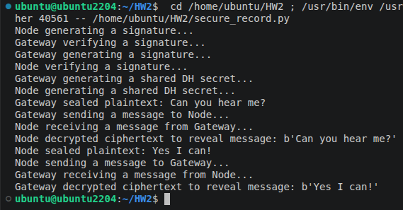

# CSCE-765 HW2, Preston Bodak 631002625

# Lab Prep

# Task 1

In order to modify a specific part of the decrypted plaintext, my design inserts
a series of bytes which match the length of the target into the ciphertext at
the same location as the target. To achieve this, it first converts the original
ciphertext into hex for ease of modification, since one byte can clearly be seen
as 2 hex characters. Since we know the plaintext and that each byte in the
plaintext maps directly to each byte in the ciphertext (due to the properties of
the XOR operation), we can see that READ belongs to bytes 11 through 14 in the
plaintext. This enables us to modify hex characters 22 through 29 in the ciphertext to produce a tampered output in the recovered plaintext. The screenshot below shows this in action.

Above, you can see that where READ was originally found in the plaintext
has been modified after decryption to show another random sequence of
four characters. The root cause of this vulnerability is that the use of XOR
in counter mode for AES does not produce sufficient diffusion of the output.
The nature of the block cipher allows us to predict where certain parts of the
plaintext will appear in the ciphertext and make unauthorized modifications before
it is decrypted. For example, this may apply to a man-in-the-middle attack, where someone even without the key to decypt the message can still be familiar with the packet/frame structure and disrupt the contents of the message.

As a bonus, the source code also contains a snippet which demonstrates the ability to recover the key by first modifying the ciphertext to contain zeroes at the location of the target. After decryption of this ciphertext, the XOR operation simply inserts the key into the target location. This key can then be XOR-ed with a target message and re-inserted into the ciphertext to produce a negating XOR effect which directly shows the desired target message upon decryption.

# Task 2

My Task 2 design blends the responsibilities of a sender/receiver and a session into a singular Session class which is instantiated to form the gateway and node for this simulation.
In doing so, a realistic barrier between private and public information can be established such that vulnerable information can be easily identified through public-channel messages.
In particular, these messages take the form of arguments to public-facing functions. As seen below, the only information that would be transmitted on a public channel to perform
this authentication and key exchange are public keys and signatures, which do not expose sensitive information.

Once this public information is exchanged, both the gateway and node have all the information they need to generate the appropriate keys for two-way communication, as seen below:

To execute this simulation, multiple steps are taken to guarantee authenticity and message integrity. First, an RSA private key is generated and used by each party to generate a signature.
These signatures are exchanged alongside public keys to be verified and confirm that each party is who they claim to be. Since this authentication is based on an indiviudal's public key,
there is no way for a man-in-the-middle to impersonate one of the two parties from this point forward. However, the communication medium may be vulnerable to listeners, and as such a
key exchange is necessary to exchange encrypted messages over the exposed channel. By exchanging public DH keys, each party is able to use their private DH key and its numeric properties to generate a shared key. With a shared secret now established, the two parties are free to practice secret key cryptography.

This process is secure against a wide variety of attacks. The communication channel is safe against replays because no authenticating information is publicly shared and it all
lies behind the information encoded with private keys. Without someone's private key, you cannot replay something like a signature because it can be invalidated with your immutable public key.
The ephemeral nature of these sessions also provides forward secrecy, since the DH keys are re-generated with a nonce for each session, making any exposed key only applicable for that session. However, much of this security lies on the authenticity provided by the signature exchange. Without the use of signatures, the DH key exchange alone does not guarantee that you are communicating with the intended party. Instead, a malicious actor could impersonate another person, initiate the key exchange, and freely receive the information they desire.

# Task 3

My implementation builds upon the structure first created for Task 2. Specifically, it provides greater key separation for each direction and enables the sending and receiving of encrypted messages for each party. Following the authenticated key exchange from Task 2, each individual is able to encrypt a message with seal() and send it to a given destination.
The receiver is then able to take that messsage and its metadata and decrypt it using open_record(). This full exchange can be seen in the screenshot below:

# Task 4

### Task Implementation

To implement Task 4, the Session class from Task 3 was exported into its own file to be imported into multiple test files to reduce repeated code. This framework was
used to simulate different attacker scenarios using the information that may be transmitted across an exposed channel.

### Security Note

State the attacker model and non-goals:
For this simulation, the attacker model is focused around a man-in-the-middle or some other malicious actor who is able to sniff traffic
over an insecure/public channel. This enables the threat actor to collect data such as header information, ciphertext, nonces, and public
keys that are transferred between two parties to establish secure communication. It is not the goal of the attacker to override authentication
or to coerce an individual to send sensitive data. Additionally, the simulated attacker does not attempt to modify any private data such as
private keys which are used to set up the communication channel.

Explain why CTR requires unique IVs:
When using CTR mode for AES, the initial value (IV) is incremented for each block which is passed through the encryption engine. For instance,
a basic IV of 1 will be used for the first block, which is automatically fed to the next block as 2, and to the next block as 3, and so on
and so forth. However, this poses a significant security risk in the event of a leaked IV. Since the block size is known, an attacker is able to
decrypt an entire sequence if the key and IV is leaked. To counteract this, CTR requires a unique IV per session/message such that only one 
sequence is vulnerable if the IV is leaked as opposed to multiple messages.

Explain why verify-before-decrypt matters:
With regards to authenticity and confidentiality, it is important to adopt a verify-before-decrypt mindset when implementing secure
communication channels. Verification can take two forms in this context: authenticating the identities of both communicators with
known public keys and verifying the MAC of a message. Ensuring a message comes from an authenticated source prior to decrypting a
message ensures that harmful content is not decrypted and stored on the machine, such as an injection attack for an AI agent. With
regards to verification of MACs, even ciphertext sent over a public channel may be intercepted and modified. As a result, MACs serve
as an essential step to knowing if a message has been tampered with and should be disposed of, since they are created based on the
original unmodified message.

Explain why independent encryption and MAC keys are used:
When performing multiple exchanges prior to initiating communication such as RSA signatures and Diffie-Hellman, implementing
key separation and independent encryption is an essential part to securing the communication medium. In the event that a threat
actor is able to recover a key used for one of these processes, having multiple keys prevents the rest of the messages from being
completely vulnerable on the channel. Similarly, a unique MAC key prevents the threat actor from modifying the ciphertext and
simultaneously generating their own MAC such that the message appears unmodified.

Compare the construction briefly with an AEAD mode such as AES-GCM:
Both the method of encryption used in this simulation and AES-GCM are similar in that they both prioritize authentication prior
to generating and transmitting encrypted messages. The simulation achieves this via an independent RSA signature exchange prior to
a standard Diffie-Hellman exchange and standard AES-CTR encryption, while this process is more unified under AES-GCM as the authentication
is built into the ciphertext blocks.

Explain why a valid protected record may still contain a dangerous authorized tool call:
For an authenticated communication between two parties, messages may still contain malicious plaintext. Although the identity of
a sender of data may match their public key and the messages may be encrypted, this still allows a user to send harmful text such as
a dangerous tool call to their destination if the two-way communication is accepted. Ultimately, the receiver (such as an AI agent),
may still decrypt the message and act on it with minimal consideration of the contents.
